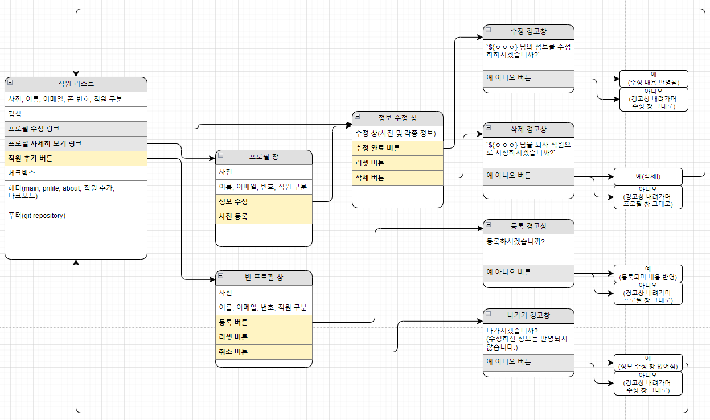
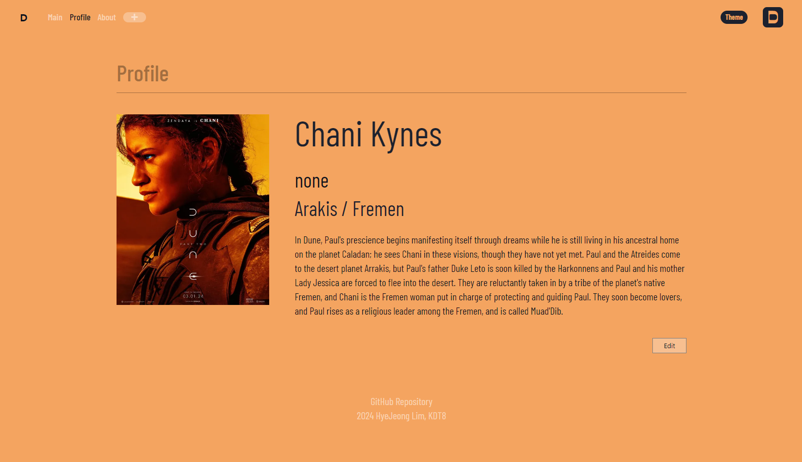
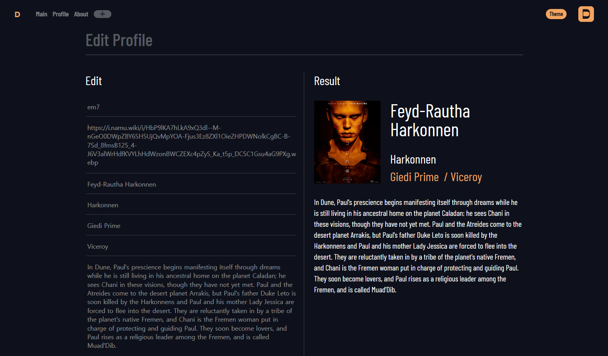
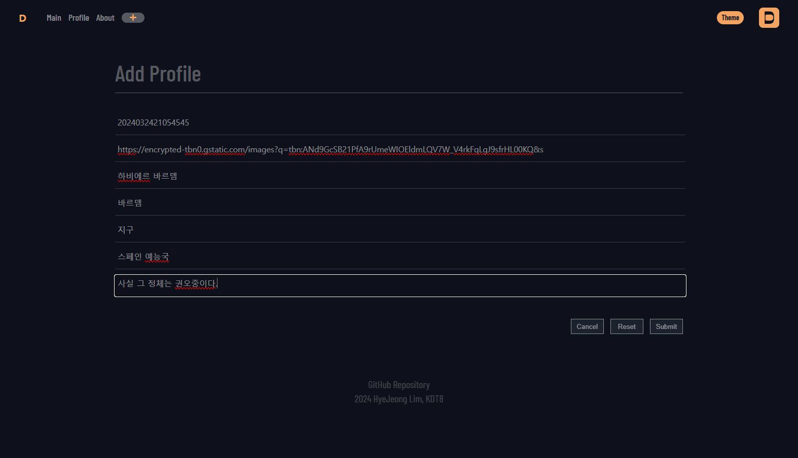
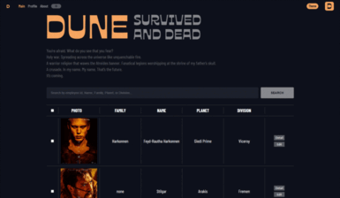

# **영화 *DUNE* 캐릭터 목록**

## 👉 **시작하기에 앞서**

***

1. 최근에 아이맥스 영화관에서 감명 깊게 본 영화 <듄>의 설정을 보다가 이 내용을 가져다 JS 과제를 진행하면 좋을 것 같았습니다.
2. 영상 강의에서 실습한 JS 스크립트를 최대한 활용해 여러 기능을 구성하고자 했습니다.

## 👉 **요구사항 반영 여부**

**1. 필수 요구 사항 중 해낸 것**
- 프로필 페이지를 만들었습니다.
- 홈에 인물 리스트를 만들었습니다.
- 캐릭터 검색 기능을 만들었습니다.
- Edit 버튼으로 진입해 인물 정보 수정을 할 수 있습니다.
- 로딩 애니메이션을 반영했습니다.
- search 버튼에 커서 hover 시 css 애니메이션이 등장하게 했습니다.
- 일부 내용에 대해 상대 수치(rem, em)를 활용해 글씨 크기를 조절했습니다.
- LocalStorage를 서버 대용으로 사용해 캐릭터 정보를 등록, 추가, 삭제할 수 있게 했습니다(이 과정에서 외부의 과외 및 도움이 있었음을 밝힙니다).
- DOM event 조작을 가능한 한 많이 이용하려 노력했습니다.

**2. 그 외 기능**
- DOM event 조작을 통해 다크 모드(실제로는 sandy 모드)를 만들었습니다. 다크 모드 실행 여부는 페이지 재진입 시에도 동작이 가능하도록 local storage에 실행 여부를 저장해 두는 방향으로 기능을 만들었습니다.

**3. 필수 요구 사항 중 애매하거나 실패한 것**
- 전체 페이지 데스크탑-모바일 반응형 페이지를 개발하세요.
- infinity scroll 기능을 추가해 보세요.

## 👉 **자료**

### 유저 플로우 ###

### 프로필 페이지 ###

### 수정 페이지 ###

### 추가 페이지 ###

### 검색 ###

### 기타 ###

#### 다크모드 ####

#### 체크박스 ####

## 👉 **좋은 점과 아쉬운 점**

**1. 좋은 점**
- 어쨌든 해냈습니다. 원하는 기능이 동작할 때 느껴지는 쾌감이 대단합니다.
- 최소한 addEventlistener나 setTimeout, location.reload, querySelector, getElementById 정도는 활용할 수 있겠다 싶은 점이 뿌듯합니다.

**2. 아쉬운 점**
- store를 잘 활용하지 못했습니다. store에 대한 개념이 부족해서인지 주요 기능이 있는 라우터에 코드를 들이붓듯이 써둔 탓에 구성이 간결하지 못합니다.
- 이미지를 로컬에 있는 것이 아니라 url을 이용해서 가져오는 방법밖에 쓸 수 없다는 사실이 너무 아쉽습니다.
- 아직 JS에 대한 개념 파악이 덜 되어서 문제 해결을 위해 여러 블로그 및 커뮤니티를 찾아다니며 코드를 찾아오거나, ChatGPT와의 문답을 거치거나, 지인의 과외와 각종 도움(특히 local storage를 서버처럼 사용하는 기능)을 통해 과제를 해나갔습니다.
